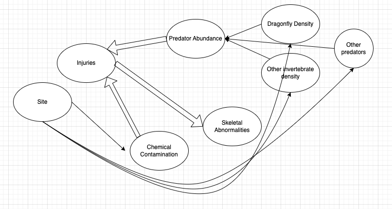

```{r, frog-binary-setup, include=FALSE}
library(tidyverse)
library(mosaic)    
library(ggformula)
library(glmmTMB)
knitr::opts_chunk$set(echo = TRUE, 
                      fig.width = 7, 
                      fig.height = 3,
                      tidy = FALSE,
                      fig.align = 'center', 
                      message = FALSE, 
                      warning = FALSE,
                      error = TRUE,
                      out.width = '60%', 
                      dpi = 300)
theme_set(theme_minimal(base_size = 22))
```

# Data Source
The dataset used here is on Alaskan wood frogs, detailing some physical characteristics, habitat characteristics, and the number of developmental and other abnormalities found in the frogs. It was originally obtained from:
.small[
<http://datadryad.org/resource/doi:10.5061/dryad.sq72d>.]

---

# Data Source

The data file can be accessed online at: <https://sldr.netlify.app/data/FrogAbnormalities.csv>

.small[
```{r, echo = TRUE, eval = FALSE}
frogs <- read_csv(
  'http://sldr.netlify.com/data/frog-abnormalities.csv')
DT::datatable(frogs, width = 500)
```
]

---

.smaller[
```{r, frogdat, echo = FALSE}
frogs <- read_csv(
  'http://sldr.netlify.com/data/frog-abnormalities.csv')
DT::datatable(frogs, width = 500)
```
]
---

<!-- # Wood Frogs -->

<iframe width="1120" height="630" src="https://www.youtube.com/embed/U9Vj_GQFGHQ" frameborder="0" allow="accelerometer; autoplay; clipboard-write; encrypted-media; gyroscope; picture-in-picture" allowfullscreen></iframe>

---
.small[
Variables in the dataset include:

-   IDs: `collection_id`, `frog_id`, `site`
-   Info on time of data collection: `date`, `year`,
    `coll_date`
-   Size and developmental stage of the frog:
    `gosner_stage`, `tail_length` (which is longer for young frogs, that
    is, tadpoles)
-   Whether or not the frog has any abnormality in general (`abnormal`),
    an injury (`bleeding_injury`), or a specific type of abnormality:
    `skeletal_abnormality`, `eye_abnormality`, `surface_abnormality`
-   Relative abundance of invertebrate predators of frogs:
    `dragonfly_relative_density` and `other_invert_relative_density`
-   *Rough* water testing results:
    `detectable_analytes` (average number of contaminants present)
]

---
# Dataset Size: n/15 revised

---
### Model Plan?

.smaller[

> > The repeated occurrence of abnormal amphibians in nature points to
> > ecological imbalance, yet identifying causes of these abnormalities
> > has proved complex. Multiple studies have linked amphibian
> > abnormalities to chemically contaminated areas, but inference about
> > causal mechanisms is lacking. Here we use a high incidence of
> > abnormalities in Alaskan wood frogs to strengthen inference about
> > the mechanism for these abnormalities. We suggest that limb
> > abnormalities are caused by a combination of multiple stressors.
> > Specifically, toxicants lead to increased predation, resulting in
> > more injuries to developing limbs and subsequent developmental
> > malformations. We evaluated a variety of putative causes of frog
> > abnormalities at 21 wetlands on the Kenai National Wildlife Refuge,
> > south-central Alaska, USA, between 2004 and 2006. Variables
> > investigated were organic and inorganic contaminants, parasite
> > infection, abundance of predatory invertebrates, UVB, and
> > temperature. Logistic regression and model comparison using the
> > Akaike information criterion (AIC) identified dragonflies and both
> > organic and inorganic contaminants as predictors of the frequency of
> > skeletal abnormalities. We suggest that both predators and
> > contaminants alter ecosystem dynamics to increase the frequency of
> > amphibian abnormalities in contaminated habitat. Future experiments
> > should test the causal mechanisms by which toxicants and predators
> > may interact to cause amphibian limb abnormalities. - Reeves et al.
> > 2010, <https://doi.org/10.1890/09-0879.1>

]
---
## Causal Diagram?

```{r, causal, echo = FALSE, out.width='97%'}

```

---
# Critique?

```{r, eval = FALSE}
skeletal_abnormality ~ detectable_analytes +
  dragonfly_relative_density +
  other_invert_relative_density
```

.small[

-   Why not include injuries? 
-   Would you include site? 
-   Why isn't the frog's developmental stage in there?
  
]
---

# Regression Evolution
## old: linear regression 

$$y = \beta_0 + \beta_1 x_1 + \beta_2 x_2 + \beta_3 x_3 + ...\beta_k x_k + \epsilon $$

- where $x$s are the $k$ predictor variables, 
- $\beta$s are the parameters to be estimated by the model, 
- and $\epsilon \sim N(0,\sigma)$ are the model residuals.

---

## Regression Evolution

.small[
When our response variable was a *count* variable, we modified our equation to:
]

$$log(\lambda_i) = \beta_0 + \beta_1 x_1 + \beta_2 x_2 + \beta_3 x_3 +$$
$$...\beta_k x_k + \epsilon_{link}$$
.small[
positing that $y_i \sim Pois(\lambda_i)$ for Poisson regression; similarly for negative binomial regression, we just replaced that Poisson distribution with a negative binomial distribution (and replaced $\lambda_i$ with $\mu_i$, stating that $y_i \sim NegBin(\mu_i, \sigma)$).
]
---

# Binary Response?

What if our response variable is *logical* -- a categorical variable with just two possible values?  We will designate one of the two values a "success," and then we want to predict the probability of success as a function of some set of predictors.  What will our model equation look like in this case?

<!-- $$ logit(p_i) = \beta_0 + \beta_1 x_1 + \beta_2 x_2 + \beta_3 x_3 + ...\beta_k x_k + \epsilon_{link}$$ -->

---

# Which Distribution?

---

# Link Functions

```{r, out.width='50%', echo = FALSE}
knitr::include_graphics('images/binary-regression-links.png')
```

.smaller[
Note: figure is from <http://data.princeton.edu/wws509/notes>].

---
## Binary Regression Equation

---

class: small

# Back to Frogs...
## How does this equation relate back to our desired response variable? 

- $y_i$, the $i$th observation of the response variable is assumed to follow a binomial distribution with probability $p_i$ 
- In other words: $y_i \sim Binom(n_i, p_i)$ 
- $n_i$ depends on the setup of the data -- often n = 1 for each row of the dataset, as here where each row is one frog. We can think of each frog as one binomial trial, with success/failure meaning abnormality/normality of the frog.

---

## Checking the data setup

- We would like to model the proportion frogs with abnormalities as a function of a set of predictors. 
- The variable `skeletal_abnormality` has values "Yes" and "No".  
- In R, if we use this (categorical) variable as our response, how will R determine which level (value of the variable) is a "success"?

---
## Response Variable

```{r}
frogs |>
  # pull out just the variable in question
  pull(skeletal_abnormality) |>
  # print out the variable's unique values
  levels()
```

---
## `factor()` Response Variable

.small[
```{r}
frogs |>
  # force our response to be "factor" not "character". 
  # This will also auto-sort the levels in to alpha order.
  # So don't do it ever AFTER you have carefully re-ordered  them!
  mutate(skeletal_abnormality = factor(skeletal_abnormality)) |>
  # pull out just the variable in question
  pull(skeletal_abnormality) |>
  # print out the variable's unique values
  levels()
```
]

---
## Better: Rearrange Levels?

.small[
```{r}
# list the values in the "new" order you want
# (here it won't actually change from the original...
# but this is how you *would* change it if needed)
frogs <- frogs |> 
  mutate(skeletal_abnormality = forcats::fct_relevel(skeletal_abnormality, 'No', 'Yes'))
# check again
frogs |> pull(skeletal_abnormality) |> levels()
```
]

---


# Model Fitting 

```{r, lrm-frogs, echo=TRUE, error = TRUE}
frog_model <- glmmTMB(skeletal_abnormality ~ 
                        detectable_analytes + 
                        dragonfly_relative_density +
                        other_invert_relative_density,
                 data = frogs,
                 family = binomial(link = 'logit'))
```


---
class: smaller

```{r}
summary(frog_model)
```

---
# Assessment
## Conditions

---
# Assessment
## ACF

```{r, frog-assess1, fig.height=2.8, echo=FALSE}
s245::gf_acf(~resid(frog_model))
```

---
## Never Do This!

.small[
```{r, frog-assess2, echo=TRUE, fig.height=4}
# DO NOT USE THIS IN YOUR OWN ASSESSMENT OF YOUR MODELS!
gf_point(resid(frog_model, type='pearson') ~ fitted(frog_model)) |>
  gf_labs(title='frog_model', 
          y=' Pearson\nResiduals',x='Fitted Values')
```
]

---
## Assessment
### Scaled Residual Plot

.small[
```{r, frog-assess3, echo=TRUE, fig.height=4}
# ACUTALLY USE **THIS** WAY FOR MEAN-VARIANCE CONDITION
library(DHARMa)
sim_frog_res <- simulateResiduals(frog_model)
plotResiduals(sim_frog_res, quantreg = FALSE)
```
]

---
# Selection
## Just as usual. 
## For example, using ANOVA:

.small[
```{r}
car::Anova(frog_model)
```
]

---
##  Prediction Plots (same as ever)

```{r, fig.width=6.5}
library(ggeffects)
ggpredict(frog_model,
          terms = 'dragonfly_relative_density') |>
  plot()
```

---

## Prediction Plots

```{r, fig.width=6.5}
ggpredict(frog_model, 
          terms = 'detectable_analytes') |>
  plot()
```