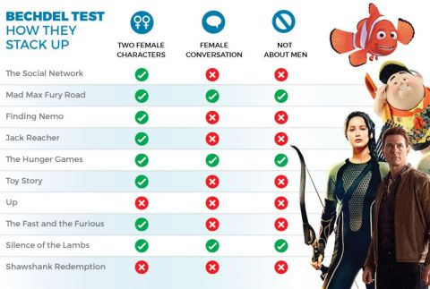

```{r, setup-lm1, include=FALSE}
require(mosaic)   # Load additional packages here 
require(ggformula)
require(tidyverse)


knitr::opts_chunk$set(echo = TRUE, 
                      fig.width = 7, 
                      fig.height = 3,
                      tidy = FALSE,
                      fig.align = 'center', 
                      message = FALSE, 
                      warning = FALSE,
                      error = TRUE,
                      out.width = '60%', 
                      dpi = 300)
theme_set(theme_minimal(base_size = 22))

options(scipen = 999)

set.seed(4)
my_data <- data_frame(predictor = rnorm(15, mean = 5, sd = 2),
                      pred1 = predictor,
                      pred2 = gl(3, 5, length = 15, labels = c("A", "B", "C")),
                 response = 1.3 - 0.7* predictor + rnorm(15, 0, 2))

my_model <- lm(response ~ pred1 + pred2, data = my_data)
```

class: huge center inverse subsection
# If INFERENCE is your goal...

---
class: small
## CIs Beyond Prediction Plots
### Slope coefficient of 0 (or CI crossing 0) means: 

```{r}
my_model <- lm(response ~ pred1 + pred2, data = my_data)
summary(my_model)
```

---
## CIs Beyond Prediction Plots
### Slope coefficient of 0 (or CI crossing 0) means: 

```{r}
my_model <- lm(response ~ pred1 + pred2, data = my_data)
confint(my_model)
```

---

## Hypothesis Tests
### *May* use but see later IC slides for alternative

```{r}
car::Anova(my_model)
```

---
# ~~`pred1` is significant~~

# no no nopeity no no never!

---
## Judge *your* strength of evidence 
## (~~significance threshold~~)


```{r, echo = FALSE, out.width='40%'}
knitr::include_graphics('https://images.squarespace-cdn.com/content/v1/64c4f5cffc1a5952f996c322/9bf085ec-4546-476c-b132-02705ed9adff/p-value.png')
```


```{r, echo = FALSE, out.width='70%'}
knitr::include_graphics('https://mtstateintrostats.github.io/IntroStatTextbook/images/soe_gradient_gray.png')
```

.smaller[Images: left, [analythical.com](https://analythical.com/blog/understanding-p-values); right, [MT State intro stat](https://mtstateintrostats.github.io/IntroStatTextbook/foundations-randomization.html?q=p-value#p-value-stat-signif)]

---
## ~~`pred1` is significant (p-value < 0.05)~~

### There is strong evidence (p-value = 0.0099) that `pred1` is associated with `response`, with the expected `response` increasing by about  \_\_\_\_ (95% CI: \_\_\_\_ to \_\_\_\_) when `pred1` increases by 1 (if `pred2` doesn't change).

*To present `Anova()` results, use your `summary()`, equation, and ESPECIALLY prediction plot to tell the story in context!*

---
class: small

# Data

```{r, echo = FALSE}
library(fivethirtyeight)
bechdel_13 <- bechdel |>
  filter(year >= 1990 & year <= 2013)  |>
  na.omit()
bechdel_13 <- bechdel_13 |>
    mutate(roi = intgross_2013 / budget_2013,
         profit = intgross_2013 - budget_2013,
         budget_2013 = budget_2013 / 1e6)
bechdel_13 <- bechdel_13 |>
  mutate(clean_test = factor(as.character(clean_test)),
         clean_test = forcats::fct_relevel(clean_test,
                                           'ok',
                                           'dubious',
                                           'men',
                                           'notalk',
                                           'nowomen'))

```

---
# Bechdel Test Model
## What is WRONG here?

```{r, bech-model-too-big, echo=TRUE, error = TRUE}
movie_mod <- lm(roi ~ clean_test + 
                  budget_2013 +
                  title,
                data = bechdel_13)
```

---

## Better-planned Model

```{r, bechdel-smaller-model, echo=TRUE}
bechdel_mod <- lm(roi ~ clean_test + 
                    budget_2013,  
                data = bechdel_13)
coef(bechdel_mod) 
```


---

## Selection w/ Information Criteria
### Why ICs? Balance conflicting goals

.small[
- Want model that *fits the data as well as possible* (which pushes us toward more predictors)
- Want *truth, efficiency* (correctly judging when predictors aren't associated with the response).  
- Solution: **minimize** the quantity $-(2ln(\mathcal{L}) - \text{penalty}) = -2ln(\mathcal{L}) + \text{penalty}$

]
---

# AIC Defined

.small[
- $\mathcal{L}$ is the "Likelihood" of data given model
- In R: `logLik(model)` gives $ln(\mathcal{L})$
- AIC: $-2 ln(\mathcal{L}) + 2k$
  - $k$ is the number of coefficients being estimated (don't forget $\sigma$!)
  - **Smaller AIC is better.**
- In R: `AIC(model)` or `AIC(model1, model2, model3...)`
]
  
---

# BIC Defined

.small[
- BIC: $-2ln(\mathcal{L}) + ln(n)k$
 - $n$ is the number of rows in dataset
 - $k$ is the number of coefficients estimated.
 - **Smaller BIC is better.**
- In R: `BIC(fitted_model)` or `BIC(model1, model2, model3...)`
]
---
class: small

## Comprehension Check: Verify BIC

```{r}
coef(bechdel_mod)
nrow(bechdel_13)
logLik(bechdel_mod)
```

## Verify that the BIC for this model is `r round(BIC(bechdel_mod))`.

---

# Decisions with ICs
## Rules of thumb (**not** laws) for decisions with ICs

.small[
- IC *lower by at least 3 units* = notably better
- If 2+ models have ICs *within* 3 IC units of each other, they fit about same 
- If $\Delta IC < 3 \text{ or so}$: model with smallest $k$ (fewest predictors) is better
]

---

# All-subsets selection
## Avoid in favor of interpreting the full model or comparing a few key models if possible

.small[
- Use `dredge()` function (`MuMIn` package) to get and display ICs for every possible combo of predictors.
- First ensure dataset has no missing values, 
- then set `na.action = 'na.fail'` input for our model (with `update()` or in `lm()`).
]
---

# `dredge()` example

```{r, ape-dredge, results = 'hide'}
require(MuMIn)
bechdel_mod <- bechdel_mod |> 
  update(na.action = 'na.fail')
bechdel_dredge <- dredge(bechdel_mod, 
                         rank = 'BIC')
bechdel_dredge 
```

---
class: small

# `dredge()` example
## What is the best model according to BIC, for this dataset?


```{r, ape-dredge-results, echo = FALSE}
require(MuMIn)
bechdel_mod <- bechdel_mod |> update(na.action = 'na.fail')
bechdel_dredge <- dredge(bechdel_mod, rank = 'BIC')
bechdel_dredge
```


---

# Which IC to use?

.small[
- AIC and BIC (and `Anova()`) may yield different conclusions, especially if the dataset is large. 
- Recommendation: choose **one** to use *a priori* (before making calculations). 
- Prefer BIC to be "more conservative" (larger penalty means predictor must improve fit *more* before we judge it worthwhile)
  ]
---

## Quantities derived from (A)IC

- $\Delta AIC$ is the AIC for a given model, minus the AIC of the best one in the dataset. (Same for $\Delta BIC$)
- *Akaike* or *BIC weights* are values (ranging from 0-1) that measure the weight of evidence suggesting that a model is the best one (given that there is one best one in the set)

---

# Important Caution

- **Very important**: IC can **ONLY** be compared for models...
  - With the exact same response variable...
  - and the exact same rows of data.

---
# Conclusions
## Evidence of association?
### Evidence the arrow (in causal diagram) is strongly, detectably *there*?

```{r}
no_bechdel_mod <- lm(roi ~ budget_2013,  
                data = bechdel_13)
AIC(bechdel_mod, no_bechdel_mod)
```

---
## ~~`pred1` is significant~~

### There is strong evidence (AIC lower by about 5) that a movie's return on investment is associated with its Bechdel test score. Specifically, after controlling for any effect of budget, model results suggest that...[use pred plot here to say which test scores predict more/less ROI!].

*To present IC results, use your `summary()`, equation, and ESPECIALLY prediction plot to tell the story in context!*