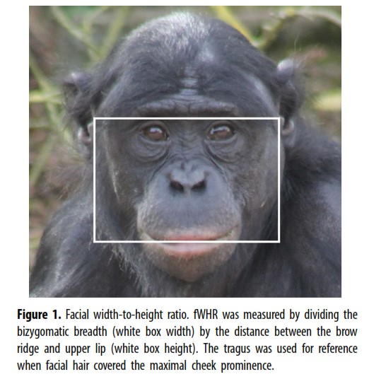

```{r, setup-lm1, include=FALSE}
library(ggformula)
library(tidyverse)


knitr::opts_chunk$set(echo = TRUE, 
                      fig.width = 7, 
                      fig.height = 3,
                      tidy = FALSE,
                      fig.align = 'center', 
                      message = FALSE, 
                      warning = FALSE,
                      error = TRUE,
                      out.width = '60%', 
                      dpi = 300)
theme_set(theme_minimal(base_size = 22))
```

## Data
We will consider a small dataset from an article by J.S. Martin and colleagues, titled [*Facial width-to-height ratio is associated with agonistic and affiliative dominance in bonobos (**Pan paniscus**)*](https://royalsocietypublishing.org/doi/suppl/10.1098/rsbl.2019.0232)

.small[
```{r data-in, message = FALSE}
bonobos <- 
  read_csv(file='http://sldr.netlify.app/data/bonobo_faces.csv')
```
]

```{r include = FALSE}
# add one missing for demo purposes
bonobos[28, 'normDS'] <- NA
```

---

## Facial Width-Height Ratio

```{r bonobo-fwhr-image, echo = FALSE, out.width = '45%'}

```


---

## Data: Variables
### We *will* explore data - let's think a bit first.
.small[
.pull-left[
- `Name` of the individual
- `Group`: zoo where the individual lives
- `Sex`, "Male or "Female"
- `Age` in years
]

.pull-right[
- `fWHR`, facial width-height ratio
- `AssR`, assertiveness score
- `normDS`, another dominance score
- `weight` in kilograms
]
]


---

## Simple Linear Regression
### ("Simple" means "one predictor")

$$ y = \text{  ?} $$
<!-- $$\beta_0 + \beta_1 x \dots$$ -->

---

## Choosing Response

- Response is the variable of greatest interest
- Response is what you may want to *predict*
- Response may be causally dependent on predictor

---

## Choosing Predictor(s)

- Response may be harder to measure, and predictor easier
- (Should have data on predictor)
- **Choosing predictor that "looks best" in data -> biased inference**

---

## For Bonobos:

- Response
- Predictor

---

## Plan. STOP! Explore.

```{r}
gf_point(AssR ~ fWHR, data = bonobos)
```


---

## To fit model: `lm()`

```{r hidden-fit-m1_simple, include = FALSE}
m1_simple <- lm(AssR ~ fWHR, data = bonobos)
```

```{r, lm-fit, fig.width=6.5, fig.height=4, echo=TRUE, eval = FALSE}
m1_simple <- lm(AssR ~ fWHR, 
          data = bonobos)
```

---
## Print Results
### Just Parameter Estimates

```{r, lm-coef, fig.width=6.5, fig.height=4, echo=TRUE}
coef(m1_simple)
```

---

## Print Results
### Full Summary

```{r, results= 'hide'}
summary(m1_simple)
```

---


## Summary

.small[

```{r, echo = FALSE}
summary(m1_simple)
```

]

---

## (Part of) Regression Equation

$$ y = \rule{1cm}{0.15mm} + \rule{1cm}{0.15mm} x \dots$$

---

## But the Line isn't Perfect

There is some error $\epsilon$ in our model for the data, so we should keep track of it.

$$ y = \beta_0 + \beta_1 x + \epsilon$$

---

## $\epsilon$ is **NOT** *one number*

### The amount of error is different for (almost) every data point! 

- How can we express this mathematically?


---

## Regression Residuals = "errors"

```{r, echo = FALSE, out.width = '90%'}
bonobos <- bonobos |>
  mutate(sr = resid(m1_simple),
         sp = predict(m1_simple))
gf_point(AssR ~ fWHR, 
         data = bonobos) |> 
  gf_lm(color = 'black', size = 2) |>
  gf_segment(AssR + sp ~ fWHR + fWHR, 
             color = 'brown2', 
             size = 0.6)
```


---

## Summarize: Distribution?

```{r}
gf_histogram(~resid(m1_simple), 
             bins = 15)
```


---

## Back to Summary

.small[

```{r, echo = FALSE}
summary(m1_simple)
```

]

---

## Complete Regression Equation

$$ y = \beta_0 + \beta_1 x + \epsilon,$$
where 

$$ \epsilon \sim N(0, \sigma)$$


---

## Bonobo Regression Equation

$$ y = \rule{2.5cm}{0.15mm} + \rule{2.5cm}{0.15mm} x  + \epsilon,$$
$$\text{ where } \epsilon \sim N(0, \rule{2.5cm}{0.15mm})$$

<!-- $$ y = 1.31 + 0.029 x + \epsilon, \text{ where } \epsilon \sim N(0, 0.169)$$ -->

