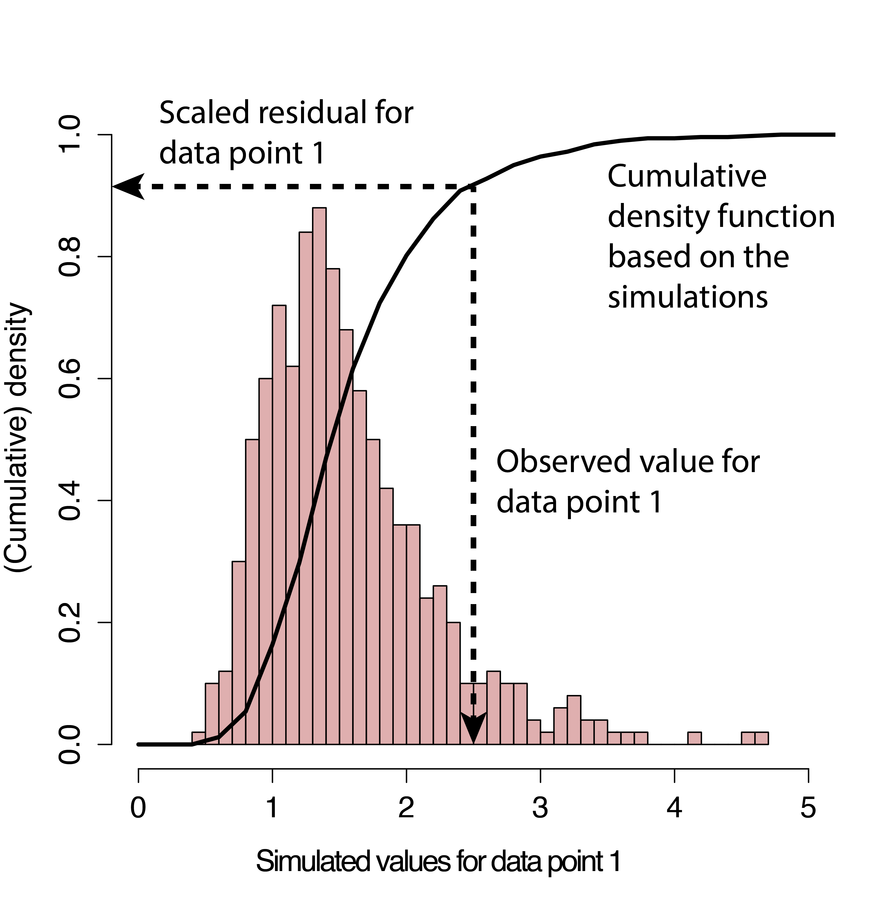

```{r, setup, include=FALSE}
library(tidyverse)
library(mosaic)    
library(ggformula)
library(glmmTMB)
knitr::opts_chunk$set(echo = TRUE, 
                      fig.width = 7, 
                      fig.height = 3,
                      tidy = FALSE,
                      fig.align = 'center', 
                      message = FALSE, 
                      warning = FALSE,
                      error = TRUE,
                      out.width = '60%', 
                      dpi = 300)
theme_set(theme_minimal(base_size = 22))

```

```{r, include=FALSE}
sscrime <- read_csv('https://sldr.netlify.app/data/sscrime.csv') |>
  mutate(Location = fct_relevel(Location, 'City', 'Town', 'Urban Fringe', 'Rural'))
```

# School Survey on Crime
Today's dataset was collected by surveying school administrators across the US about crimes and violent incidents that took place in their school (as well as some characteristics of each school).  We will try to fit a model to predict the number of **thefts** reported at each school.

---

# Plan: Candidate Predictors

.pull-left[
- `Security` 
- `SecurityCameras`
- `Lockers`
- `LockedGates`
]

.pull-right[
- `Location` (City, Town, Urban Fringe, Rural)
- `NEnrollment` (number of students)
- `TrainingHours` for staff on prevention
]

---

# Graphs

```{r}
gf_point(Thefts ~ TrainingHours, data = sscrime)
```

---

# Graphs

```{r}
gf_boxplot(Location ~ Thefts,
           data = sscrime)
```

---

# Graphs

```{r}
gf_point(Thefts ~ NEnrollment, data = sscrime)
```

---

# Graphs

```{r}
gf_boxplot(Thefts ~ Lockers | LockedGates,
           data = sscrime) |>
  gf_jitter(color = 'grey44', alpha = 0.1)
```


---


# Multiple Linear Regression
## This is NOT going to go well...
## doing it to show why we need a new kind of model

```{r}
theft_lm <- lm(Thefts ~ NEnrollment + Location + 
                 TrainingHours + SecurityCameras, 
               data = sscrime)
```

---
class: smaller

```{r}
summary(theft_lm)
```

---
## Response vs Fitted: *optional* way to see ~~good~~badness of fit

```{r}
gf_point(Thefts ~ fitted(theft_lm), 
         data = sscrime) |>
  gf_abline(intercept = 0, slope = 1)
```

.smaller[*What would this graph look like if $R^2$ were 1?*]

---

# Assessment

```{r}
gf_point(resid(theft_lm) ~ fitted(theft_lm))
```

---

# Assessment

```{r}
gf_histogram(~resid(theft_lm))
```

---

# Problems

---
# Solution: Count Regression

## Adjust regression equation so that the model *expects* count data as the response

## Which distribution(s) may come in handy?

---

# Poisson Regression
## (The math)

---
# Poisson Regression - R
## this is a GLM = "Generalized Linear Model"

```{r}
theft_pois <- glm(Thefts ~ NEnrollment + Location + 
                 TrainingHours + SecurityCameras, 
               data = sscrime,
               family = poisson(link = 'log'))
```

---
# Poisson Regression - R
## Another way to do SAME thing - more extensible

```{r}
library(glmmTMB)
theft_pois <- glmmTMB(Thefts ~ NEnrollment + Location + 
                 TrainingHours + SecurityCameras, 
               data = sscrime,
               family = poisson(link = 'log'))
```

---
class: smaller

```{r}
summary(theft_pois)
```

---

# Response vs Fitted

```{r, message = FALSE}
gf_point(Thefts ~ fitted(theft_pois), 
         data = sscrime) |>
  gf_abline(intercept = 0, slope = 1)
```

---

## Assessment for Poisson Regression (Conditions)

- Response ( $y$ ) is *count data*
- (log)-Linearity: $log(\lambda_{i})$ is a linear function of the covariates $x_1$, $x_2$, ... $x_n$
- Mean-variance relationship: Mean (of response) = Variance (of residuals)
- Independence (of residuals)
- **NO** Normal condition or other PDF residuals should follow

---

# Poisson vs. Linear Model

```{r, echo = FALSE, out.width='50%'}
knitr::include_graphics('https://bookdown.org/roback/bookdown-bysh/bookdown-bysh_files/figure-html/OLSpois-1.png')
```

*[Roback and Legler Section 4.2.2](https://bookdown.org/roback/bookdown-bysh/ch-poissonreg.html)*

---

# Assessment
## Independence - check it same as before

```{r}
s245::gf_acf(~resid(theft_pois)) |> gf_lims(y = c(-1,1))
```

---

# Assessment
## Linearity (for quantitative predictors)

```{r}
gf_point(log(Thefts) ~ NEnrollment, 
         data = sscrime)
```

---
# Assessment
## Linearity (for quantitative predictors)

```{r}
gf_point(log(Thefts) ~ TrainingHours, 
         data = sscrime)
```

---

## Assessment: Error Variance
### DON'T REALLY USE THIS
### Error Variance **is equal to mean predicted count**

```{r}
gf_point(resid(theft_pois, type = 'response') ~ 
           fitted(theft_pois)) |>
  gf_labs(y = 'Response Residuals', x = 'Fitted Values')
```

---
## Assessment: Error Variance
### DON'T REALLY USE THIS
### Pearson residuals: scale each residual by expected variance

```{r}
gf_point(resid(theft_pois, type = 'pearson') ~ 
           fitted(theft_pois)) |>
  gf_labs(y = 'Pearson Residuals', x = 'Fitted Values')
```

---
## Assessment: Error Variance
### DON'T REALLY USE THIS
### Bin residuals and plot mean, var for each bin

```{r, message = FALSE}
resid_mean_var <- sscrime |>
  mutate(preds = fitted(theft_pois),
         resids = resid(theft_pois, type = 'response'),
         pred_bins = cut(preds, 15)) |>
  group_by(pred_bins) |>
  summarize(mean_pred = mean(preds),
            var_resid = var(resids))
```

---
## Assessment: Error Variance
### DON'T REALLY USE THIS
### Bin residuals and plot mean, var for each bin

```{r}
gf_point(var_resid ~ mean_pred,
         data = resid_mean_var) |>
  gf_abline(intercept = 0, slope = 1)
```

---
# Oh My Goodness Help
### (and it will only get worse)
### We need [a **better way**](https://cran.r-project.org/web/packages/DHARMa/vignettes/DHARMa.html#motivation) to check mean-variance conditions henceforth.

- Simulate new data from fitted model
- Repeat to get expected distribution for each residual
- Standardize residuals on 0-1 scale .smaller[(0 = all simulated resid are larger than real resid; 0.5 means half of simulated resids are larger than real resid).]
- Standardized resids should be Uniform (0, 1)

---

# Profiles in Statistics
## Florian Hartig, University of Regensburg

```{r, echo = FALSE, out.width = '25%'}
knitr::include_graphics('http://florianhartig.files.wordpress.com/2012/11/fh-std-web-sw.jpg')
```

---

## Visually:

```{r, echo = FALSE, out.width = '45%'}

```

.smaller[
*from [https://cran.r-project.org/web/packages/DHARMa/vignettes/DHARMa.html](https://cran.r-project.org/web/packages/DHARMa/vignettes/DHARMa.html)*
]

---
# DHARMa Scaled Residuals
## We can use for all models from now on! (even `lm()` ones!)

```{r, message = FALSE}
library(DHARMa)
pois_sim <- simulateResiduals(theft_pois)
plotResiduals(pois_sim) 
```

---

# DHARMa Scaled Residuals
## How it *should* look if all is well: 
## UNIFORM vertically, trendless

```{r, include = FALSE}
testData = createData(sampleSize = 250)
library(lme4)
fittedModel <- glmer(observedResponse ~ Environment1 + (1|group) , family = "poisson", data = testData)
simulationOutput <- simulateResiduals(fittedModel = fittedModel)
```

```{r, echo = FALSE, fig.height = 4}
plotResiduals(simulationOutput)
```

---
# Status: Limited Succeses
## Poisson model seems *a bit* better for count data

- never predicts negative counts
- expects some "trumpet"
- New method to check resid vs fitted when not "normal, constant variance"

---
# Status
## Remaining Issues

- **Overdispersion common** (variance > mean: "super-trumpet"; Poisson's not good enough)
- Offsets?  Counts per *what?* (Thefts per capita or per school?)


