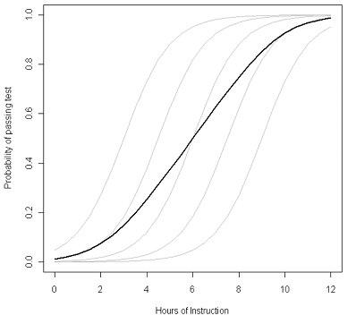

```{r setup, include=FALSE}
library(tidyverse)
library(mosaic)    
library(ggformula)
library(glmmTMB)
library(DHARMa)
library(s245)
knitr::opts_chunk$set(echo = TRUE, 
                      fig.width = 7, 
                      fig.height = 3,
                      tidy = FALSE,
                      fig.align = 'center', 
                      message = FALSE, 
                      warning = FALSE,
                      error = TRUE,
                      cache = TRUE,
                      out.width = '60%', 
                      dpi = 300)
theme_set(theme_minimal(base_size = 22))

zc_dives <- read.csv('http://sldr.netlify.com/data/zshal.csv') |>
  mutate(SonarA = factor(SonarA),
         SonarB = factor(SonarB),
         TagID = factor(TagID)) |>
  mutate(SonarAPercScale = 
           scale(SonarAPercOL.fill),
         SonarBPercScale = 
           scale(SonarBPercOL.fill))
```


## Our RE model for whale dive duration and sonar

```{r}
rem4 <- glmmTMB(DurAvg ~ DepthAvg + TransClass + 
                  SonarA + (1|TagID/TagDayPeriod), 
             data = zc_dives,
             REML = FALSE)
```

---

class: smaller

```{r}
summary(rem4)
```


---
class: small
## Typical (average) RE Group vs. Population Average

- Random effects models provide predictions for the *average or typical RE group*. 
- **For a linear regression model (or any model with the identity link function, that is, no link function), the predicted values for the population average and typical-RE-group average are the same**.  
- But with a link function in the mix, **it's different**. 

---
class: small
# Typical (average) RE Group vs. Population Average

.pull-left[
```{r, fig.height = 3, fig.width = 3, out.width='75%', echo=FALSE, message = FALSE}
library(RColorBrewer)
colrs <- brewer.pal(5, 'Set2')
gf_abline(intercept=~c(-.2, -.1, 0, .1, .2),
          slope=~c(1,1,1,1,1)/12,
          color= 'grey84', lwd=2) |> gf_lims(x=c(0,12),
                                   y=c(-.4,1.4)) |>
  gf_abline(intercept = 0, slope = 1/12, color = 'black', lwd = 2)
```
]

.pull-right[

```{r, echo = FALSE, out.width='85%'}

```
]

---

## Predictions with CIs for *Typical (average) RE Group* 
### Easily done, but *do not* include random effects variability

$$y = \beta_0 + \beta_1x_1 + ... \beta_kx_k + \epsilon_{RE} + \epsilon_{resid},$$

$$\epsilon_{RE} \sim N(0, \sigma_{RE}); \epsilon_{resid} \sim N(0, \sigma_{resid})$$

---
class: small

## Pred. plot w/ `ggpredict()`

```{r, ggpred-plot, fig.show = 'hide', message = FALSE}
library(ggeffects)
ggpredict(rem4, 
          terms = 'SonarA', 
          type = 'fixed') |> 
  plot() |> 
  gf_labs(y = 'Dive Duration (minutes)',
          title = '') |>
  gf_lims(y = c(17, 28))
```

---

## Pred. plot w/ `ggeffects::ggpredict()`

```{r show-pred-plot, ref.label = 'ggpred-plot', echo = FALSE}

```


*BUT: What uncertainty is included here? Is $\epsilon_{RE}$ included?*

---
class: small
## Including $\epsilon_{RE}$
### Should you do this? Depends if want to include variation across RE groups (whale/hours)

```{r, ggpred-plot-wre, fig.show = 'hide'}
ggpredict(rem4, 
          terms = 'SonarA', 
          type = 're') |> 
  plot() |> 
  gf_labs(y = 'Dive Duration (minutes)',
          title = '') 

```


---
## Including $\epsilon_{RE}$
### Should you do this? Depends if want to include variation across RE groups (whale/hours)

```{r, ref.label='ggpred-plot-wre', echo = FALSE}
```

---
class: small

## Parametric bootstrap to the rescue!
How can we get *population average* predictions?

- simulate data, based on our model, for (simulated) new RE groups. (Include uncertainty related to random effects, AND intercept/slope estimates)
- re-fit the model to the simulated data
- make predictions from the re-fitted-to-simulated-data model
- repeat LOTS of times to get a *distribution* of predicted values
- take a point-wise average over all those RE groups (and also use them to find a CI)
- result: population average predictions and confidence intervals.


---
# Parametric Bootstrap
## To obtain **population-average** predictions with CIs

We can do this with help from the function `bootMer()` from the `lme4` package.

---
class: small

# Parametric Bootstrap
## 1. create **function** that makes **predictions from our model**.

```{r}
predict_rem4 <- function(model){
  new_dat <- data_grid(
    model,
    terms = 'SonarA',
    condition = c(TagID = "14",
                  TagDayPeriod = "2011-01-06.(18,20]")
  )
  return(predict(model, 
                 newdata = new_dat,
                 type = "response", 
                 allow.new.levels = TRUE,
                 re.form = NULL))
}
```

---
# Parametric Bootstrap
## 2. Simulate, make predictions for many new fake individuals

```{r, fig.width=6.5, fig.height=2.5, message = FALSE}
library(lme4)
# this will take a while
boot_rem4 <- bootMer(rem4, 
                     FUN = predict_rem4, 
                     nsim = 1000, 
                     type = "parametric", 
                     use.u = FALSE)
```

---
# Simulation Results

```{r}
glimpse(boot_rem4$t)
# show the first few rows of results
head(boot_rem4$t)
```

---

# Parametric Bootstrap
## 3. Compute CIs from simulated-individual predictions

```{r, fig.width=6.5, fig.height=2.5}
new_data_pboot <- data_grid(rem4, 
                       terms = 'SonarA') |>
  mutate(pred = apply(boot_rem4$t, 2, mean),
         CIlow = apply(boot_rem4$t, 2, 
                       quantile, probs = 0.025),
         CIhigh = apply(boot_rem4$t, 2, 
                        quantile, probs = 0.975)
         )
```

---
# Parametric Bootstrap
## 3. Compute CIs from simulated-individual predictions

.small[
```{r, fig.width=6.5, fig.height=2.5}
glimpse(new_data_pboot)
```
]

---
# Parametric Bootstrap
## 4. Plot results

```{r, pboot-plot, fig.show = 'hide'}
gf_point(pred ~ SonarA, data = new_data_pboot) |>
  gf_labs(x='Sonar A Presence', 
          y='Dive Duration\n(minutes)') |>
  gf_errorbar(CIlow + CIhigh ~ SonarA, 
              data = new_data_pboot, width = 0) |>
  gf_lims(y = c(17, 28))
```

---
# Parametric Bootstrap
## 4. Plot results (& compare w/ ave. RE group)

.pull-left[

```{r, ref.label='pboot-plot', echo = FALSE, out.width = '90%'}
```
]

.pull-right[
```{r, ref.label = 'ggpred-plot', echo = FALSE, out.width = '90%'}
```
]