class: bigger
```{r setup, include=FALSE}
library(tm)
library(wordcloud)
library(RColorBrewer)
library(ggformula)
library(googlesheets4)
library(leaflet)
library(tidyverse)

knitr::opts_chunk$set(echo = FALSE, fig.width = 6, fig.height = 4,
                      fig.align = 'center', message = FALSE, warning = FALSE,
                      out.width = '60%', dpi = 300)
theme_set(theme_minimal(base_size = 22))

my_wordcloud <- function(variable){
  corp <- Corpus(VectorSource(variable))
corp <- tm_map(corp, content_transformer(tolower))
corp <- tm_map(corp, removeNumbers)
corp <- tm_map(corp, removeWords, stopwords("english"))
corp <- tm_map(corp, removePunctuation)
corp <- tm_map(corp, stripWhitespace)
dtm <- TermDocumentMatrix(corp)
m <- as.matrix(dtm)
v <- sort(rowSums(m),decreasing=TRUE)
d <- data.frame(word = names(v),freq=v)
wordcloud(words = d$word, freq = d$freq, min.freq = 1,
          max.words=200, random.order=FALSE, rot.per = 0, fixed.asp = FALSE,
          colors=brewer.pal(8, "YlGnBu")[4:8])
}

# googlesheets4::gs4_auth(email = 'sld33@calvin.edu')
```


# Welcome!

- Choose a seat...*WISELY*!
- Consider: do you match the statement on the paper?

---

- Do you match the statement on the paper?
  - Add your name if yes!
- *Trade* time...
  - Collect as many names as possible
  - Trade pages as needed to leave *nobody* with a lie

---
class: bigger

# Content: Regression

<p class="aligncenter">
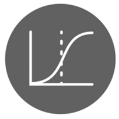
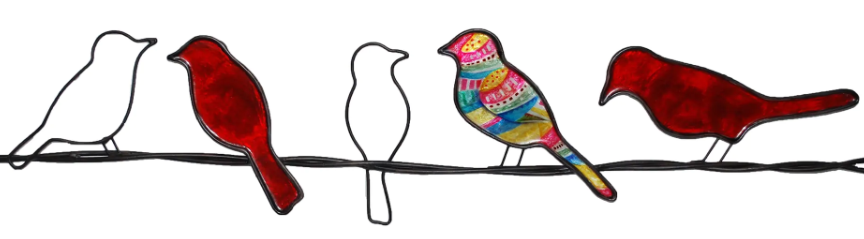
</p>

<p class="aligncenter">
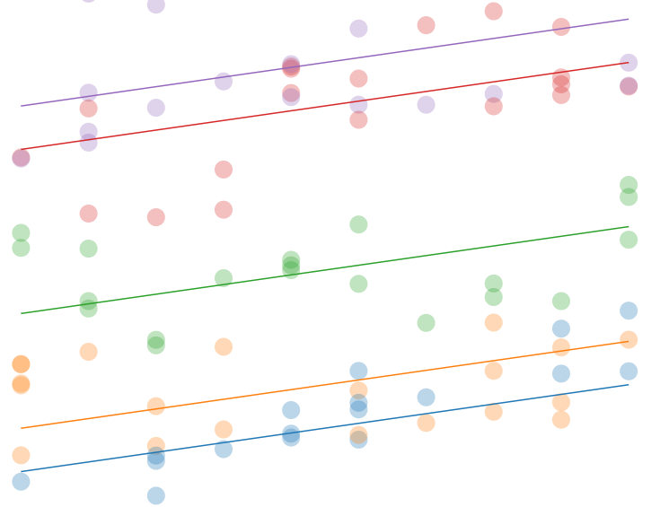
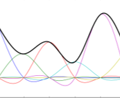
</p>


.smaller[
<br>
<br>
*images: mfviz.com/hierarchical-models, overstock.com, knowledgebase.aridhia.com/article/logistic-regression/*
]
---
class: bigger

# Content: Projects

<p class="aligncenter">
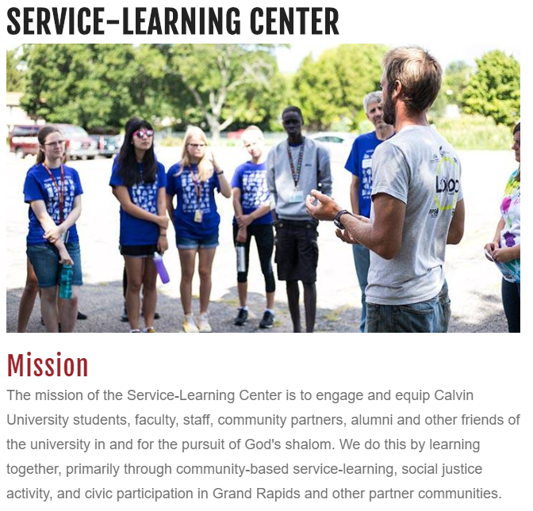
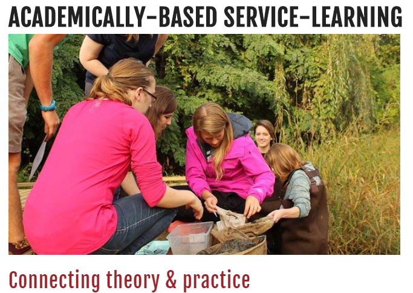
</p>

.smaller[
<https://calvin.edu/offices-services/service-learning-center>
]
---
class: bigger

# Content: Projects

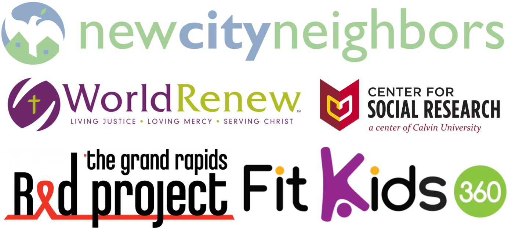


---
class: bigger

# More (Global) Partners

<p>

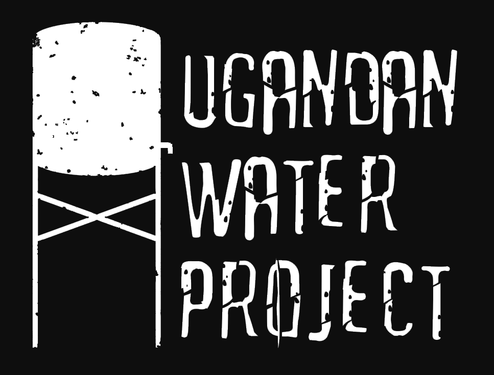

</p>

.smaller[
*world icon: thenounproject.com*
] 

---
class: bigger
# Projects 1.0: Oops

<p class="aligncenter">


</p>

.smaller[
*icons: flaticon.com, vectorstock.com, icon-library.com*
]

---
class: bigger

# **Questions** and **Answers**
## With **models** as reality check

<p class="aligncenter">


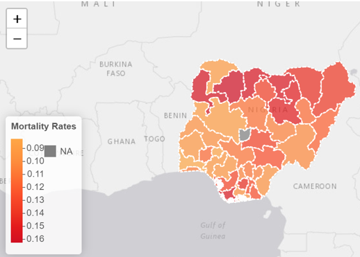
</p>

.small[
Plan, Ready Data, <br>
Pretty Figures, Models, Interactive
]

.smaller[
*icons: thenounproject.com, measureevaluation.org, mfviz.com/hierarchical-models*
]

---
# New: Project Showcase

```{r, out.width='90%', echo = FALSE}
knitr::include_graphics('https://cdn.churchleaders.com/wp-content/uploads/files/article_images/1112InviteEVERYONE_184871241.jpg')
```

---
class: bigger

# Group Work &*^!...?

```{r flying-grade, out.width='25%'}
knitr::include_graphics('https://wp.dailybruin.com/images/39374_web.1.7.moradi.grades.illo.jpg')
```

---
class: bigger

# R/RStudio


- [r.cs.calvin.edu](https://r.cs.calvin.edu/)
- (Stand-alone [install](https://connect.cs.calvin.edu/DATA545/install-R/))
- Self-paced tutorials - assignment for next week


---
class: inverse middle center big-subsection
# R/RStudio:

```{r we-can2, echo = FALSE, out.width = '70%'}
knitr::include_graphics('https://upload.wikimedia.org/wikipedia/commons/thumb/d/df/We_Can_Do_It%21_NARA_535413_-_Restoration_2.jpg/1200px-We_Can_Do_It%21_NARA_535413_-_Restoration_2.jpg')
```

---
class: bigger

# R/RStudio

- Start intro/graphics tutorials *now*
- Next Tuesday: Work (without me)!
- Coming: 
  - More help sessions from me (TBA)
  - Study sessions: Tu/Th, NH 261, 7-9pm

---
class: bigger

# RAC: Case Studies 
## ( & Tests... & Projects...)

- 1: Graphics
- 2: Analysis
- 3: Peer Critique
- 4: Revision

.small[
- Extra: Practice + solutions often provided
]

---
# Usual Weekly Schedule

- **Readings** due Tues. nights
- **Data analysis** due Thurs. nights
- In-class **Quizzes** Thursdays
- **Project milestones** weekly
- Every class will include team practice


---
class: bigger

# Thursday(ish) Quizzes

 - Short, Low-stakes
 - Mostly in-class (perhaps Moodle too)
 - Lowest 3 scores dropped
 - See me if you wish to make up a missed quiz

---
class: bigger

# 3 Tests

- Take-home (1 week)
- Work...*together*???
- Open resource (except outsourcing)
- No late work


---
class: bigger

# Final (Not-Exam)

- Project showcase 12/19. *Public!*
  - Work you did
  - Experience with partner & team
- Project revisions & reflections 12/19.
  - Not in-person

---
class: bigger

# Late Homework

- Sooner is better
- Done is good
- < 48h -10%, longer -25%
- All done by end of classes April 26

---
class: inverse middle center big-subsection

# [Data are People.](https://journals.plos.org/ploscompbiol/article?id=10.1371/journal.pcbi.1005399#sec002) People (You) Matter. 

---
# Data are People?

- Consider the "commandment" that *Data are People* alongside the [Heidelberg Catechism Q & A #6](https://www.crcna.org/welcome/beliefs/confessions/heidelberg-catechism). Thoughts?
- Speaking from a Reformed Christian perspective, what if anything would be different about this "commandment"? Explain why, citing sources if any.

---
class: inverse middle center big-subsection

# Pause


```{r data-in, include = FALSE}
# run in console
gs4_auth(email = 'sld33@calvin.edu', scopes = "https://www.googleapis.com/auth/spreadsheets.readonly")
# 2022 data
# ssid <- as_sheets_id("https://docs.google.com/spreadsheets/d/1SpqLI8YleAYvMitqlSYC7Vw-kNWAG123KyY9lBoGKtA/edit?resourcekey#gid=1798041811")
# 2023 data
ssid <- as_sheets_id("https://docs.google.com/spreadsheets/d/17PBgxTVyymAkIzATmUAwZU3KJo8unfOUWIVGp1WXEcA/edit?usp=sharing")
survey <- read_sheet(ssid)
names(survey) <- c('time', 'full_name', 'schedule_junk',
                   'name', 'home', 'languages',
                   'hobby', 'feeling', 'prayer', 'year_at_calvin',
                   'grad_year', 'major', 'minor', 
                   'why_stat245', 'prev_stats', 
                   'junk0', 'R', 'Python', 'C', 'Java', 'JavaScript', 'Other','Git/Github',
                   'data_topics', 'notes') 
survey <- survey |>
  filter(time > lubridate::dmy_hms('1/1/2023 00:00:00'))
# survey$score <- 10
# survey$grad_year <- unlist(survey$grad_year)
# write_csv(survey, path = 'student-survey-results.csv')
```

---
# Prayers for This Time

```{r, prayer-words, fig.width = 8, fig.height = 4.5, out.width = '90%'}
my_wordcloud(survey$prayer)
```

---
## I Corinthians 8:1-3

>> Now regarding your question about food that has been offered to idols. Yes, we know that "we all have knowledge" about this issue. But while knowledge makes us feel important, it is love that strengthens the church. Anyone who claims to know all the answers doesn’t really know very much. But the person who loves God is the one whom God recognizes.

---

# Prayers for this time

.small[
- For wisdom, focus, determination, discernment
- Energy, discipline, health of body and mind
- For stress and anxiety to stay manageable
- For ability to care for ourselves and others
]

---

# Topic: Graphics

- Hint: **Notice** the graphics that I show you today!

---
class: inverse middle center big-subsection

# More Survey Results

---

# How We Feel

```{r}
gf_density(~feeling, data = survey)
```

---
# Feeling and Class

```{r}
gf_point(year_at_calvin ~ feeling, data = survey, size = 4)
```

---
# Why We're Here

```{r}
why <- data.frame(for_major = mean(grepl('required for my major', survey$why_stat245)),
                  for_minor = mean(grepl('required for my minor', survey$why_stat245)),
                  love = mean(grepl('love', survey$why_stat245)),
                  goals = mean(grepl('career', survey$why_stat245)),
                  hear_good = mean(grepl('heard good', survey$why_stat245)),
                  rstudio = mean(grepl('RStudio', survey$why_stat245)),
                  service_learning = mean(grepl('service-learning', survey$why_stat245)),
                  schedule = mean(grepl('schedule', survey$why_stat245))) |>
  pivot_longer(cols = everything(), names_to = 'reason', values_to = 'proportion') |>
  mutate(percent = proportion * 100)

gf_col(percent ~ reason, data = why) 
```


---
class: inverse middle center big-subsection

# What went wrong?

---

# What went wrong?

```{r}
# m
theme_set(theme_minimal(base_size = 10))

A <- gf_col(percent ~ reason, data = why) |>
  gf_labs(title = 'A')

B <- gf_point(year_at_calvin ~ feeling, data = survey, size = 1.2)  |>
  gf_labs(title = 'B')

C <- gf_density(~feeling, data = survey) |>
  gf_labs(title = "C")

gridExtra::grid.arrange(A, B, C, nrow = 1)

```


---

# Drab to Fab!

- Source: 
  - [Cetinkaya-Rundel and Tackett 2020](https://doi.org/10.1080/09332480.2020.1754074) 
  - ([free version](https://github.com/mine-cetinkaya-rundel/take-a-chance/blob/master/2020-02-drab-to-fab/2020-02-drab-to-fab.pdf))

---

# What's the Point?

```{r}
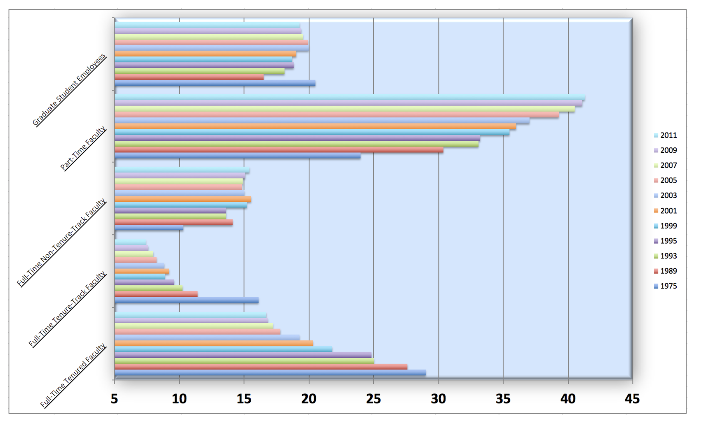
```

.small[
From: 2013 AAUP Report, *"Trends in Instructional Staff Employment Status"*
]

---
class: inverse middle center big-subsection

# Imagine it Better:

## SHOW the STORY


---

# One idea: Stacked Bars

```{r}
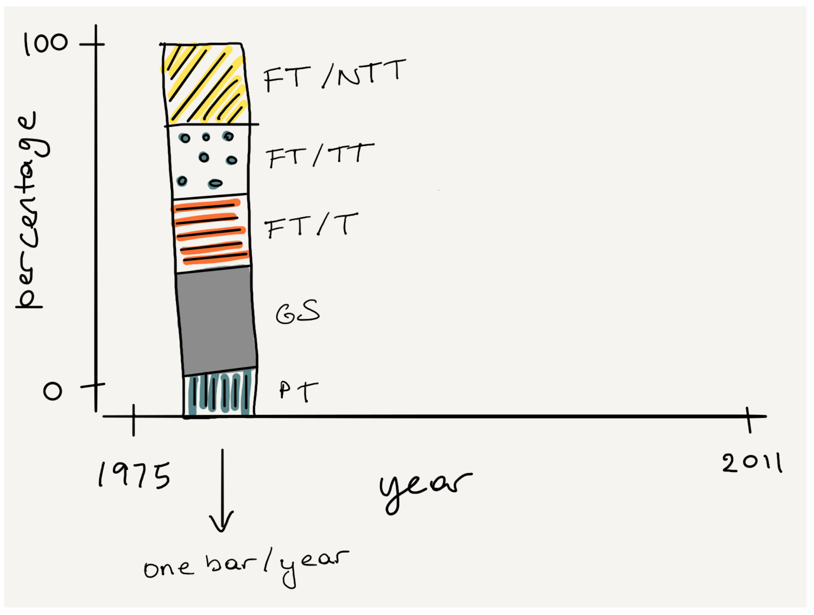
```

---
# Not Yet...

- You likely *can't* replicate the example R code yet (and today won't teach you  how)
- Goal: Start forming habits of thinking...
  - Get used to structure of a graphics command
  - Imagine a desired result *before* typing code
  - Think creatively about problems, causes, solutions

---

# Stacked Bars in R

```{r}
staff_wide <- read_csv("http://bit.ly/chance-staff")
staff_long <- staff_wide |>
pivot_longer(cols = -faculty_type, names_to = "year", values_to = "percentage")
```

```{r echo=TRUE, eval = FALSE}
gf_col(percentage ~ year, fill = ~faculty_type, 
       position = 'stack',
       data = staff_long) 
```

---

# Stacked Bars R Result

```{r echo = FALSE}
gf_col(percentage ~ year, fill = ~faculty_type, 
       position = 'stack',
       data = staff_long) 
```

---
# Lines?

```{r, echo = TRUE, fig.show = 'hide'}
gf_line(percentage ~ year, 
        color = ~faculty_type,
        data = staff_long)
```

---
# Lines?

```{r, echo = FALSE}
gf_line(percentage ~ year, 
        color = ~faculty_type,
        data = staff_long)
```


- *What went wrong? Check the X axis...*

---
# Lines (actually)

```{r, echo = TRUE, fig.show = 'hide'}
gf_line(percentage ~ parse_number(year), 
        color = ~faculty_type,
        data = staff_long)
```


---
# Lines (actually)

```{r, echo = FALSE}
gf_line(percentage ~ parse_number(year), 
        color = ~faculty_type,
        data = staff_long)
```


---
# Color to Highlight

```{r, echo = TRUE}
staff_long <- staff_long |>
  mutate(part_time = 
           fct_other(faculty_type,
                     keep = "Part-Time Faculty"))
```

---
# Color to Highlight

```{r, echo = TRUE}
grey_lines <- gf_path(percentage ~ parse_number(year), 
                      color = ~part_time,
                      group = ~faculty_type,
                      data = staff_long) |>
  gf_theme(
    scale_color_manual(name = "",
                       values = c('red', 'gray')))
```


---
## Color to Highlight
```{r, echo = TRUE}
grey_lines
```

---
# Better Labels

```{r, echo = TRUE, fig.show = 'hide'}
grey_lines |>
  gf_labs(y = "Percent", x = '', 
          title = 'Part-time Faculty Increasing') |>
  gf_theme(legend.position = 'bottom') |>
  gf_lims(y = c(0,45))
```

---
# Better Labels

```{r, echo = FALSE, fig.width = 7, fig.height = 4}
theme_set(theme_minimal(base_size = 26))
gf_path(percentage ~ parse_number(year), 
                      color = ~part_time,
        size = 2,
        data = staff_long) |>
  gf_theme(scale_color_manual(name = "", 
                              values = c('red', 'gray')))  |>
  gf_labs(y = "Percent", x = '', title = 'Part-time Faculty Increasing') |>
  gf_theme(legend.position = 'bottom', legend.text = element_text(size = 16),
           legend.margin=margin(-30,0,0,0),
        legend.box.margin=margin(-10,-10,-10,-10)) |>
  gf_lims(y = c(0,45))
```


---

# Take Home Ideas

- *Think* and *Imagine* before you graph
- Choose a chart type that fits your data
 - Categorical: bars, pies, Cleveland dot/lollipop
 - Quantitative: histogram, density, boxplot
 - Relationships: scatter plot, boxplots, facets...
- Use color, axis limits, labels, design *to tell the story*

---

# Go Forth...

- Today got you thinking...
- Tutorials will fill in the details...
- *And* give you R code tools to implement
- Next time: Constructive conversation + critique
- Next week: practice creating and critiquing

---
# Wait a sec...

## If graphs tell the whole story, why learn models??

---
# Profiles in Stats

.small[
.pull-left[
```{r, out.width = '400px', fig.cap = 'Mine Cetinkaya-Rundel'}
knitr::include_graphics('https://d3njjcbhbojbot.cloudfront.net/api/utilities/v1/imageproxy/https://coursera-instructor-photos.s3.amazonaws.com/b5/fcd6d8d95e823c0e13a032212a319c/mcr.JPG?auto=format%2Ccompress&dpr=2&w=200&h=200')
```
]
]

.small[
.pull-right[
```{r, out.width = '400px', fig.cap = 'Maria Tackett'}
knitr::include_graphics('https://mathematicallygiftedandblack.com/wp-content/uploads/2020/02/Feb14_MariaTackett.jpg')
```
]
]

---
# Profiles in Stats

.small[
.pull-left[
```{r, out.width = '400px', fig.cap = 'Yihue Xie'}
knitr::include_graphics('https://pbs.twimg.com/profile_images/205337390/robstat_400x400.png')
```
]
]

.small[
.pull-right[
```{r, out.width = '550px', fig.cap = 'Yihue Xie'}
knitr::include_graphics('https://usesthis.com/images/interviews/yihui.xie/portrait.jpg')
```
]
]

---
class: bigger

# Get in Touch

- Email: stacy.deruiter@calvin.edu
- Teams chat - anytime
- More contact info on Moodle
- [Outlook calendar bookings](https://outlook.office.com/bookwithme/user/1eb1c306640849d9a1e31df06798f467@calvin.edu?anonymous&ep=plink)

---
class: bigger

# Questions?
<br>
# Help
.small[
- <https://calvin.edu/offices-services/center-for-student-success/>
- <https://calvin.edu/offices-services/counseling-and-wellness/>
]